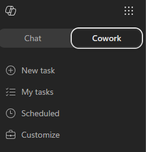
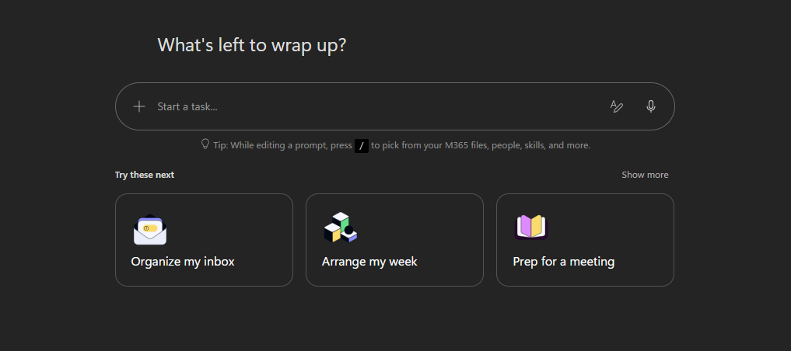
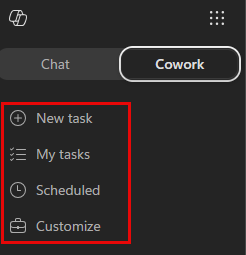
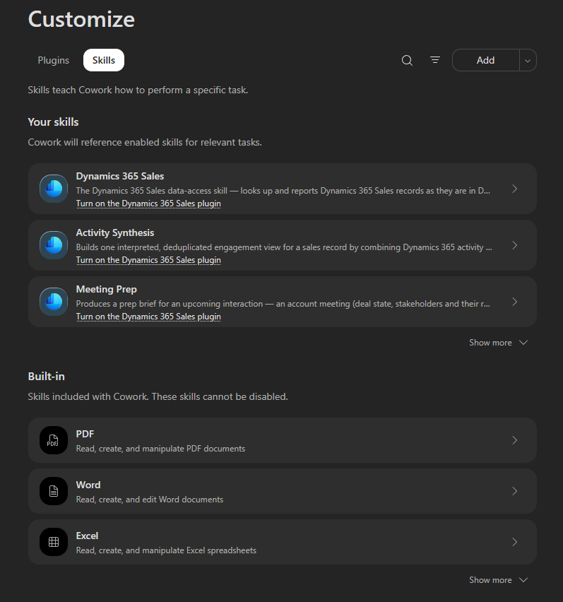
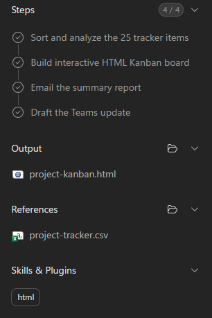
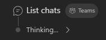

---
lab:
    title: Get Started with Copilot Cowork
    description: Get oriented in Copilot Cowork, find where your skills and controls live, and run your first task.
    level: 100
    duration: 15
    islab: false
    primarytopics:
    - Microsoft 365 Copilot
---

Before you delegate real work to Copilot Cowork, it helps to know your way around — where your skills and controls live, and how Cowork works through a task while keeping you in control. In this exercise, you'll get oriented, then run your first task: you'll point Cowork at a project tracker and have it analyze the work, build a visual board, send you a summary email, and draft a Teams update for your review. Cowork does the heavy lifting, but you stay in control — it checks in for your approval before it acts.

> [!NOTE]
> Cowork adapts to the context it has, so it won't behave identically for everyone. Depending on what it already knows, or what permissions are already set up, it might open an action window or ask a clarifying question before it runs. If your experience doesn't match every step exactly, that's expected.

## Before you begin

You'll need:

- Access to Microsoft 365 Copilot with Cowork.
- The sample project tracker, which you'll attach in the second half of the exercise. It contains 25 fictional tasks across several workstreams, with columns for status, priority, percent complete, start and due dates, owner, and notes. Statuses are a mix of Completed, In Progress, Not Started, and Blocked, so the board fills out nicely.

<!-- markdownlint-disable-next-line MD033 -->
📥 **Download the sample file:** <a href="../../Resourcefiles/project-tracker.csv" download="project-tracker.csv">project-tracker.csv</a>

## Find your way around

Before you run anything, learn where the important surfaces live.

1. Open [Microsoft 365 Copilot](https://m365.cloud.microsoft/chat/).

1. Select **Cowork**.

    

    You land on the Cowork homepage. From here you can type a new task in the prompt window, try one of the pre-built task samples, or pick up where you left off from the recent tasks list.

    

    > [!NOTE]
    > Your Cowork homepage may look slightly different depending on when you access it.

1. In the prompt area, select **+** and note the three ways to add context:

    - **Add work context** — reference files, people, emails, and Teams chats from your organization.
    - **Upload images and files** — browse your device.
    - **Attach cloud files** — pick from OneDrive, SharePoint, or Teams.

1. Look at the **left navigation** under the Cowork tab. This is how you move between your work:

    

    - **New task** — start a fresh task in a clean conversation.
    - **My tasks** — return to tasks you've already run.
    - **Scheduled** — review and set up prompts to run automatically on a recurring schedule.
    - **Customize** — manage your plugins and skills, including any custom skills you add.

1. Select **Customize**, then select the **Skills** tab. Browse the **built-in skills**. These are the skills Cowork draws on automatically, so you don't have to call them by name. Notice skills like **html**, **Communications**, and **Documents**, which you'll see in action shortly.

    

> [!TIP]
> You don't pick skills manually. Cowork loads the right ones on demand based on what you ask. You'll watch this happen in the next section.

## Run your first task

Now put it together. You'll give Cowork some context to work from, send a task, and watch it build a board, send you a summary email, and draft a Teams update, checking in for your approval as it acts.

1. Attach the sample **project-tracker.csv** you downloaded in [Before you begin](#before-you-begin). Drag and drop it into the conversation, or use **+** > **Upload images and files**.

    > [!TIP]
    > **Want to make it real?** Instead of the sample file, point Cowork at your own work: attach a task list, project tracker, or status spreadsheet you already have, or use **+** > **Add work context** to reference a few recent emails or a Teams chat about an ongoing project. The steps are the same. Just expect different results.

1. Add a couple of new lines after the attachment using **Shift + Enter** to make some space, then paste the following prompt:

    ```text
    Help me get a clear picture of where this project stands.

    1. Read through the file I've shared and sort the items into what's open,
       in progress, and done. Call out the few that most need attention.
    2. Build an interactive HTML Kanban board with three lanes - Open / Needs Action,
       In Progress / Monitoring, and Done - plus a compact header showing the total
       item count, how many are open, how many are done, and the single item that most
       needs attention.
    3. Send me a summary report via email.
    4. Write a brief Teams update for a project channel. Don't post it - I just want the draft to review.

    If anything's unclear or missing, ask me one focused question before you start.
    ```

1. Select the send arrow (the white circle with the black arrow, bottom-right of the prompt field) to submit the prompt.

1. As Cowork works, watch it think out loud. It shows a step-by-step progress log, the skills it loads, and the files it produces. Notice:

    - Which **skills** activate (for example, an html skill, then a communications skill).
    - Which files appear in the **output** for you to download or preview.
    - Any **references** it used from your work context.

    

    > [!NOTE]
    > The thinking indicator lets you know when Cowork is breaking your request into steps and working through them, narrating as it goes. Behind it is [Work IQ](https://learn.microsoft.com/en-us/microsoft-365/copilot/extensibility/work-iq), the intelligence layer that reasons across your emails, meetings, files, chats, and calendar to find what's relevant, within your organization's permissions.
    >
    > 

1. When Cowork finishes, open the **HTML board** it produced to preview it directly in the conversation.

1. Go to [Outlook](https://outlook.office.com) and check your inbox. You should have a summary email from Copilot Cowork.

## Review what came back

A successful run looks like this:

- ✅ An HTML board is generated and previewable in the conversation.
- ✅ The board clearly separates open, in-progress, and completed items.
- ✅ You received a summary email in your inbox.
- ✅ A Teams update draft is prepared, not posted.
- ✅ You can point to where skills activated, what Cowork produced, and where it asked for your approval.

Take a moment to reflect:

- What did Cowork surface that you didn't expect?
- Which skill activation was most useful here?
- Which action did you hold back from approving, and why?

## Summary

You found your way around Copilot Cowork, then ran a task that analyzed a data file before it acted, producing a board, a summary email, and a Teams update draft for your review. Along the way you saw the pattern you'll reuse for real work: Cowork discovers first and acts second, loads the right skills on its own, and checks in for your approval before anything leaves your hands.
