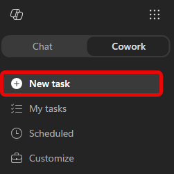
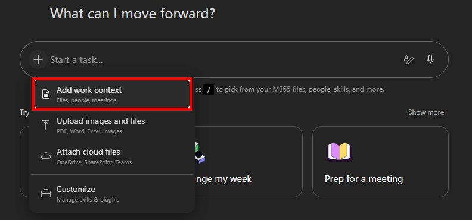

---
lab:
    title: Your Weekly Manager Update
    description: Have Copilot Cowork reconstruct your week into a manager update.
    level: 100 
    duration: 15 
    islab: false 
    primarytopics:
    - Microsoft 365 Copilot
---

Some of your most repetitive writing isn't a document at all — it's the recap you assemble for your manager. Every week, or right before a 1:1, you stitch together what you got done: scrolling sent mail, checking off tasks, remembering which meetings mattered. It's the same gather-and-shape work you delegated earlier in this module, so it's a natural thing to hand to Cowork. In this exercise, you'll have Cowork reconstruct your week from your own Microsoft 365 activity and draft a manager-ready update you can review, adjust, and forward.

> [!NOTE]
> This exercise runs in your own Microsoft 365 environment, so your results reflect your real work. Cowork adapts to the context it has — it may ask a clarifying question or open an action window for some learners and not others. If your experience doesn't match every step exactly, that's expected.

## Before you begin

You'll need:

- Access to Microsoft 365 Copilot with Cowork.
- A week's worth of your own activity to draw on — sent mail, completed tasks, meetings, and Teams messages from roughly the last seven days.

## Reconstruct your week

1. Open [Microsoft 365 Copilot](https://m365.cloud.microsoft/chat/), select **Cowork**, and start a **New task**.

   

1. Give Cowork your work context. Select **+** → **Add work context** and point it at your recent activity: sent emails, completed tasks, meetings you led or attended, and an active Teams channel or two from the past week.

    

    > [!TIP]
    > If you're not sure what to reference, just describe the window in your prompt (for example, "the last 7 days") and let Cowork search. Adding a few specific threads or tasks sharpens the result.

1. In the **Start a new task...** prompt field, copy and paste the following prompt:

    ```text
    Reconstruct what I accomplished at work over the past week and draft a concise manager update I can use in my next 1:1 or manager check-in.

    Before writing, review my Microsoft 365 activity from the last seven days:

    - Sent emails and threads I actively drove
    - Teams chats and channel messages where I contributed meaningfully
    - Meetings I led, presented in, or owned follow-up for
    - Files I created or edited across Word, PowerPoint, Excel, Loop, and OneNote

    Focus on work that moved something forward. Ignore routine back-and-forth, FYI noise, and status-only or recurring meetings unless they produced a decision, deliverable, or next step.

    Structure the update in three sections:

    - Accomplished — What shipped, progressed, or became clearer. Be specific, and tie each item to a real artifact, thread, or meeting. Don't include anything you can't point back to.
    - Needs input — Open questions, blockers, or decisions where I may want my manager's help. If there's nothing substantive, write "n/a."
    - Looking ahead — Work continuing or starting next week, inferred from this week's activity and my upcoming calendar. Don't transcribe my calendar; only name a specific meeting if it's real work I'm driving. Flag any upcoming out-of-office, handoffs, or timing risks.

    Keep it tight enough to skim in under a minute. If a section is thin, tell me what context to add rather than padding it. If you're unsure whether something belongs, flag it as uncertain instead of guessing.
    ```

1. Select the send arrow (to the right of the prompt field) to submit the prompt.

1. Cowork should come back with a draft email ready to send. Review the draft.

    

    Select **Send** to receive in your Outlook inbox, or **Cancel** to discard the draft and start over.

    > [!NOTE]
    > Choosing **Cancel** discards the draft, it isn't saved anywhere. If we asked Cowork to *draft* an email instead, it would save to your Outlook **Drafts** folder.

## Review what came back

Cowork's first draft is a starting point, not a finished answer. Check it against what you know:

- Does **Accomplished** reflect the work that actually mattered, with each item tied to something real?
- Is **Looking ahead** grounded in your genuine upcoming work, rather than a copy of your calendar?
- Did it surface anything you'd forgotten you did this week?

If a section feels thin or off, steer it: name the thread it missed, tell it to drop an item, or point it at more context — just as you refined results throughout the module.

## Summary

You just turned a recurring chore into a single request. Instead of scrolling through mail, tasks, and meetings to reconstruct your week, you described the outcome you wanted and let Cowork gather, shape, and draft it — leaving you to do the part only you can: review and decide. That's the same delegation pattern you'll reach for whenever the work is *gather, then summarize*.
