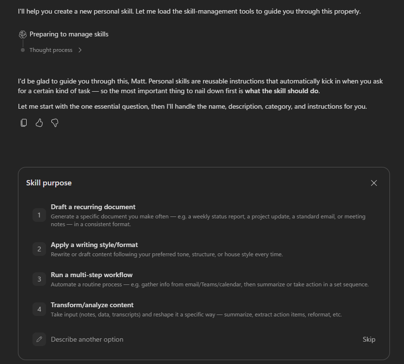

---
lab:
    title: Build Your First Cowork Skill
    description: Teach Copilot Cowork a repeatable way of working by building your own custom skill.
    level: 100
    duration: 15
    islab: false
    primarytopics:
    - Microsoft 365 Copilot
---

Some work needs to be done a certain way, every time. The same report structure, the same steps in the same order, or drafts that sound like you instead of generic. A custom skill captures that. A skill is a small set of saved instructions Cowork loads automatically whenever a certain kind of task comes up, so you teach it once and it applies every time. In this exercise, you'll build your first custom skill using Cowork's guided builder. You won't write any code or edit any files — Cowork interviews you and assembles the skill for you.

> [!NOTE]
> This exercise runs in your own Microsoft 365 environment, so your skill is built around your real work. Cowork adapts to the context it has, so it may ask different follow-up questions for different learners. If your experience doesn't match every step exactly, that's expected.

## Before you begin

You'll need:

- Access to Microsoft 365 Copilot with Cowork.
- Something worth teaching Cowork — a recurring document, your writing style, or a routine process. You'll choose one in the next step.

## Pick something worth teaching

A good first skill captures something you do on a rhythm, or want done a consistent way. Pick one:

- **A recurring document** you produce often — a weekly status, a project update, meeting notes — in a consistent format.
- **Your writing style** — your tone and structure, so drafts come back sounding like you instead of generic.
- **A routine multi-step process** — gather from email, Teams, or calendar, then summarize or act in a set order.

> [!TIP]
> If you completed the previous exercise, "make my manager update sound like me" is a perfect first skill. It builds directly on the update you just automated.

## Build your skill

1. Open [Microsoft 365 Copilot](https://m365.cloud.microsoft/chat/) and select **Cowork**. In the navigation pane, select **Customize**, open the **Skills** tab, and select **Add**.

    

    > [!TIP]
    > Or skip the menu and just tell Cowork what you want, starting with "I'd like to build a skill that ..."

1. From here, Cowork drives. It asks what the skill should do, then follows up on the details — tone, structure, what to always or never do. Answer in plain language, be specific, and keep going until the skill it drafts captures what you want. You can refine the name, description, and instructions anytime.

    

## Try it out

1. Start a new task in Cowork and ask it to do something that triggers your new skill, without mentioning the skill by name.

1. Watch the side panel: your skill should load on its own. Compare the result to what you'd have gotten before you built it.

> [!NOTE]
> Your skills live under **Customize** > **Skills**, and each one is saved as a `SKILL.md` file in your OneDrive (under `Documents/Cowork/skills/`). You can edit or remove them anytime, or ask Cowork to refine it.
>
> **Want to go further?** A skill is just a Markdown file, so you don't have to use the builder. You can write one yourself, or have another AI chatbot draft the `SKILL.md` for you, then add it from the **Skills** page with **Upload skill**.

## Check your work

Check your result against these:

- The skill saved and appears under **Customize** > **Skills**.
- It loaded on its own when you gave a relevant task, without naming it.
- The output reflects the instructions you gave — tone, structure, or steps.

## Summary

You just taught Cowork something once and made it reusable. Instead of re-explaining your format or tone every time, you captured it as a skill that loads on its own whenever the work comes up. That's the shift from delegating a task to delegating a *way of working* — the move to reach for whenever you find yourself giving Cowork the same instructions more than once.
